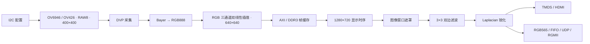

# OV6946 FPGA Image Preprocessing Pipeline

基于 Artix-7 的图像预处理加速工程：采集 OV6946 相机链路的 RAW8 数据，完成 Bayer 转 RGB、双线性插值、DDR3 帧缓存、双边滤波与拉普拉斯锐化，通过 HDMI 显示，并接入 RGB565 UDP 发送链路。

**当前状态：** 源码入口已统一，工程依赖检查、模块自检仿真、Vivado RTL 展开和顶层综合已通过。整机图像、DDR 帧切换、以太网收发及板级时序仍需验证，见 [验证记录与已知问题](docs/validation.md)。

## 数据流



分辨率来自当前顶层参数。640×640 图像与 720p 光栅、DDR 读取和 UDP 窗口的对齐，需按 [上板说明](docs/bring-up.md) 校准。

## 环境与入口

| 项目 | 配置 |
| --- | --- |
| FPGA | Xilinx Artix-7 `xc7a100tfgg676-2` |
| 工具版本 | Vivado 2020.2，含 XSim 和 7-series 器件支持 |
| 工程 | [vivado/CMOS_OV6946_HDMI.xpr](vivado/CMOS_OV6946_HDMI.xpr) |
| 活动顶层 | [rtl/FPGA_Test.v](rtl/FPGA_Test.v) |
| 引脚与时序约束 | [rtl/FPGA_Test.xdc](rtl/FPGA_Test.xdc) |
| 系统参考时钟 | 25 MHz、27 MHz |
| 显示配置 | 1280×720；74.25 MHz 像素时钟、371.25 MHz 串行时钟 |
| 仓库检查 | Python 3.10+，仅使用标准库 |

约束对应原工程硬件连接。移植前核对原理图、电平、DDR3 型号和 PHY 延迟配置。传感器寄存器表保留模块名 `I2C_OV426_400400_Config`，需与实际相机模组匹配。

## 快速开始

克隆并进入仓库：

```sh
git clone https://github.com/Sanssssssssssssssss/ov6946-fpga-image-preprocess-accel-pipeline.git
cd ov6946-fpga-image-preprocess-accel-pipeline
```

在已配置 Vivado 命令行环境的终端运行：

```sh
python scripts/check_project.py
vivado -mode batch -nojournal -log build-sim.log -source scripts/sim.tcl
vivado -mode batch -nojournal -log build-check.log -source scripts/build.tcl -tclargs check
```

第一条检查工程路径、头文件和活动模块重名；第二条运行除法器与同步延迟自检；第三条生成 IP 输出并展开实际顶层。**RTL 展开允许厂商 IP 作为黑盒，不代表综合或板级验证通过。** GitHub Actions 仅运行第一项。

生成综合结果或 bitstream：

```sh
vivado -mode batch -nojournal -log build-synth.log -source scripts/build.tcl -tclargs synth
vivado -mode batch -nojournal -log build-bitstream.log -source scripts/build.tcl -tclargs bitstream
```

构建脚本在 `build/project/` 创建工程副本；报告放在 `build/`，bitstream 位于 `build/project/image_preprocess.runs/impl_1/`。失败返回非零退出码。实际验证范围见 [验证记录](docs/validation.md)。也可用 GUI 打开 XPR，活动源码直接指向根目录 `src/`、`rtl/`。

## 目录

```text
rtl/                     顶层与活动 XDC
src/
  cmos_i2c/              相机配置、I2C、DVP 采集
  isp/                   Bayer 解码、行缓存、窗口遮罩
  Video_Image_Processor/ 插值、双边滤波、锐化、除法器
  axi/                   DDR 帧缓存控制与位宽转换
  lcd_24bit_ip/           显示时序、分辨率宏
  rgb2dvi/               TMDS 编码与串行输出
  eth/                   活动 UDP 数据通路
  io/                    IO 原语封装、同步延迟
vivado/                  XPR 与工程引用的 IP 配置/输出
ipc/                     原始 IP 导出材料
legacy/                  旧顶层、备用协议栈、实验代码
scripts/                 依赖检查、构建、仿真入口
tests/                   自检 testbench
docs/                    上板说明、验证记录
```

旧版本已归档到 `legacy/`，同名模块不能与活动源码一起递归导入。以 XPR 文件集为准；`src/` 也保留少量未启用的辅助模块。Vivado 导入副本已迁出，后续直接编辑 `src/` 和 `rtl/`。

## 参数与接口

| 调整项 | 位置 | 当前配置 |
| --- | --- | --- |
| 相机 / 插值尺寸 | `rtl/FPGA_Test.v` | 400×400 → 640×640；Q0.16 缩放比 40960 |
| 显示时序 | `src/lcd_24bit_ip/lcd_para.v` | `VGA_1280_720_60FPS_74_25MHz` |
| 滤波与锐化 | `src/Video_Image_Processor/` | 每个 RGB 通道独立处理 |
| 同步延迟 | 顶层 `u_lag_module` | VS/HS/DE 为 6/47/47 个像素时钟 |
| 网络端点 | `src/eth/UDP_SEND_READ.v` | `192.168.1.2:8080` → `192.168.1.102:8080` |
| 图像打包 | `src/eth/Pixeldata2eth.v` | RGB565、行号、`0xAAAA` / `0xBBBB` 标记 |

网络发送使用静态目标 MAC，部署前改为接收端网卡地址。当前没有配套上位机图像重组程序；包长和窗口边界的已知不一致见 [上板说明](docs/bring-up.md)。

## 开发与许可

修改后运行依赖检查和模块仿真。涉及尺寸、FIFO、时钟域或流水线级数时，还需验证数据与 VS/HS/DE 对齐，并检查综合、实现和时序报告。

仓库包含继承 RTL 与厂商 IP，不能将整个工程视为 MIT 授权。维护文件的授权范围和已有组件来源见 [LICENSE](LICENSE) 与 [NOTICE](NOTICE)。
